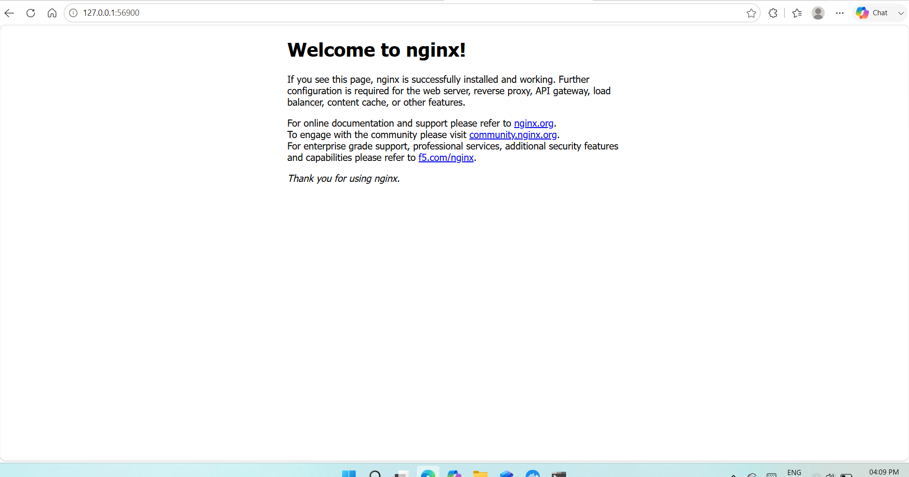

# Exercise 1: Running an Nginx Pod on Minikube

## Objective

Set up a local Kubernetes cluster using Minikube, deploy an Nginx Pod, expose it using a NodePort Service, and access the application through a web browser.

## Prerequisites

- Windows 11
- Docker Desktop
- Minikube
- kubectl

## Step 1: Start the Minikube Cluster

Minikube was started using Docker Desktop as the container driver:

```powershell
minikube start --driver=docker
````

### Output

```text
PS C:\Users\nehab> minikube start --driver=docker
😄  minikube v1.38.1 on Microsoft Windows 11 Home Single Language 25H2
✨  Using the docker driver based on user configuration
❗  Starting v1.39.0, minikube will default to "containerd" container runtime. See #21973 for more info.
📌  Using Docker Desktop driver with root privileges
👍  Starting "minikube" primary control-plane node in "minikube" cluster
🚜  Pulling base image v0.0.50 ...
🔥  Creating docker container (CPUs=2, Memory=3900MB) ...
🐳  Preparing Kubernetes v1.35.1 on Docker 29.2.1 ...
🔗  Configuring bridge CNI (Container Networking Interface) ...
🔎  Verifying Kubernetes components...
    ▪ Using image gcr.io/k8s-minikube/storage-provisioner:v5
🌟  Enabled addons: storage-provisioner, default-storageclass
🏄  Done! kubectl is now configured to use "minikube" cluster and "default" namespace by default
```

The Minikube cluster was successfully created and `kubectl` was configured to use it.

---

## Step 2: Create an Nginx Pod

An Nginx Pod was created using the official Nginx container image:

```powershell
kubectl run hello-k8s --image=nginx --port=80
```

### Output

```text
pod/hello-k8s created
```

This creates a Pod named `hello-k8s` and exposes port `80` inside the Pod.

---

## Step 3: Verify the Pod

The Pod status was checked using:

```powershell
kubectl get pods
```

Initially, the Pod was still starting:

```text
NAME        READY   STATUS              RESTARTS   AGE
hello-k8s   0/1     ContainerCreating   0          12s
```

After a few seconds, the Pod reached the `Running` state:

```text
NAME        READY   STATUS    RESTARTS   AGE
hello-k8s   1/1     Running   0          41s
```

This confirms that the Nginx container was successfully created and is running inside the Kubernetes cluster.

---

## Step 4: Expose the Pod Using a NodePort Service

The Pod was exposed using a NodePort Service:

```powershell
kubectl expose pod hello-k8s --type=NodePort --port=80
```

### Output

```text
service/hello-k8s exposed
```

The created Services were verified using:

```powershell
kubectl get services
```

### Output

```text
NAME         TYPE        CLUSTER-IP    EXTERNAL-IP   PORT(S)        AGE
hello-k8s    NodePort    10.110.75.7   <none>        80:31512/TCP   11s
kubernetes   ClusterIP   10.96.0.1     <none>        443/TCP        99s
```

The `hello-k8s` Service is using the `NodePort` type and maps port `80` of the Nginx application to NodePort `31512`.

---

## Step 5: Access the Nginx Application

The Minikube Service command was used to open the application:

```powershell
minikube service hello-k8s
```

### Output

```text
┌───────────┬───────────┬─────────────┬───────────────────────────┐
│ NAMESPACE │   NAME    │ TARGET PORT │            URL            │
├───────────┼───────────┼─────────────┼───────────────────────────┤
│ default   │ hello-k8s │ 80          │ http://192.168.49.2:31512 │
└───────────┴───────────┴─────────────┴───────────────────────────┘

🔗  Starting tunnel for service hello-k8s.

┌───────────┬───────────┬─────────────┬────────────────────────┐
│ NAMESPACE │   NAME    │ TARGET PORT │          URL           │
├───────────┼───────────┼─────────────┼────────────────────────┤
│ default   │ hello-k8s │             │ http://127.0.0.1:56900 │
└───────────┴───────────┴─────────────┴────────────────────────┘

🎉  Opening service default/hello-k8s in default browser...
```

The Nginx application was successfully opened in the browser.

> **Note:** When using the Docker driver on Windows, the terminal running `minikube service` needs to remain open because Minikube maintains the service tunnel through that terminal.

---


## Browser Result

The Nginx application was successfully accessed through the Minikube service.


```
